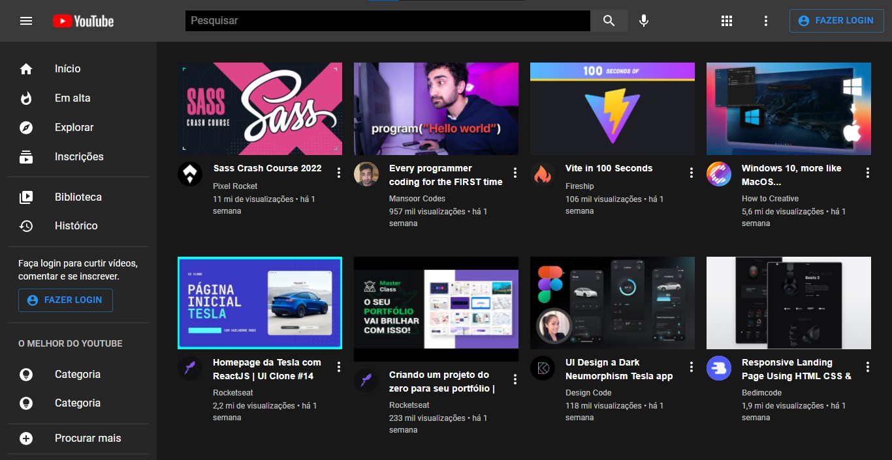

<!---->

# Clone YouTube Interface - ReactJs + Material UI

Esse projeto foi feito por: <strong>Thiago Silva Lopes</strong>, em 03/2022, 
tendo como base o <a href="https://www.youtube.com/watch?v=u9FnmBdBl5k" target="_blank">tutorial</a>
do canal do Youtube: <a href="https://www.youtube.com/channel/UCVE9-HO_GzLtDK4IGKVSYXA" target="_blank">
Lucas Nhimi</a>.

## Demo:
